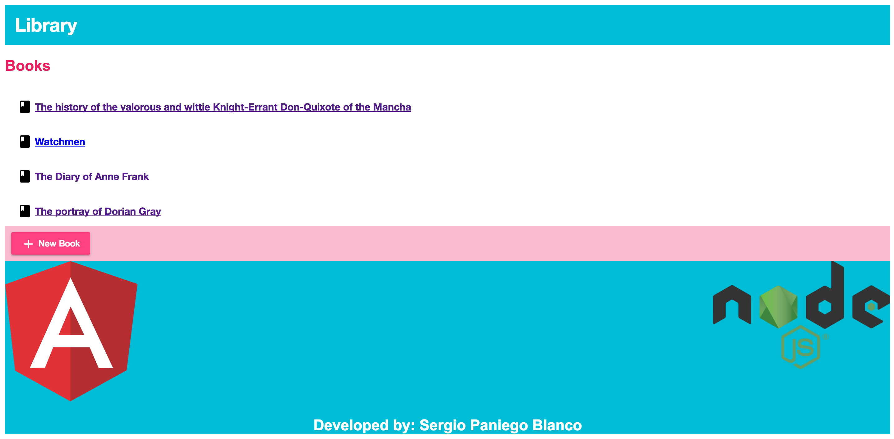
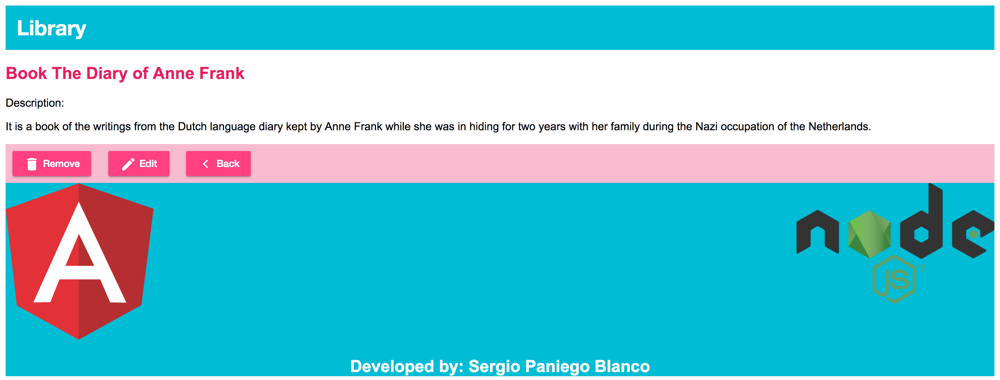
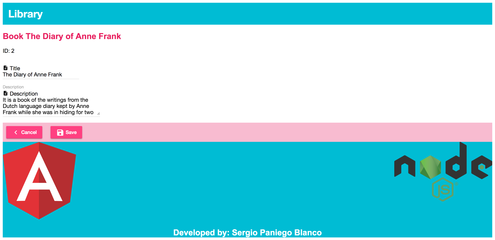
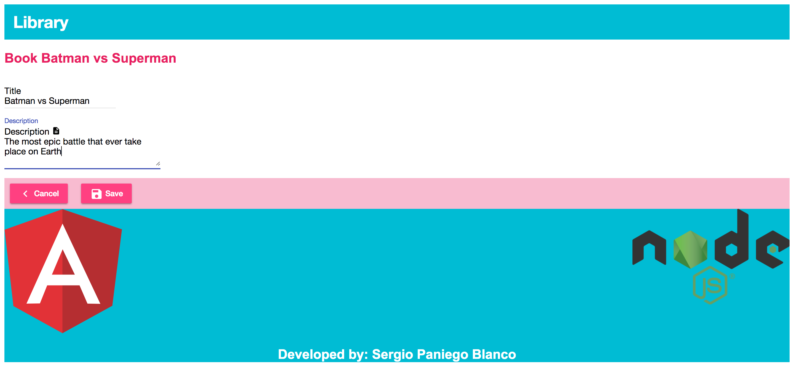

# Books-Manager
* __Small project in Angular related to an Angular, Ionic &amp; NodeJS course.__  
---
## Instructions
* __Requirements__   
  * Node version 7.8.0.
  * Npm version 4.2.0.

* __How to use the project__   
  * git clone the project to your computer or download the zip .
  * node Backend/api.js to run the backend with the Angular part built in it  .
  * http://localhost:8080 to run the app.
---
## Screenshots

